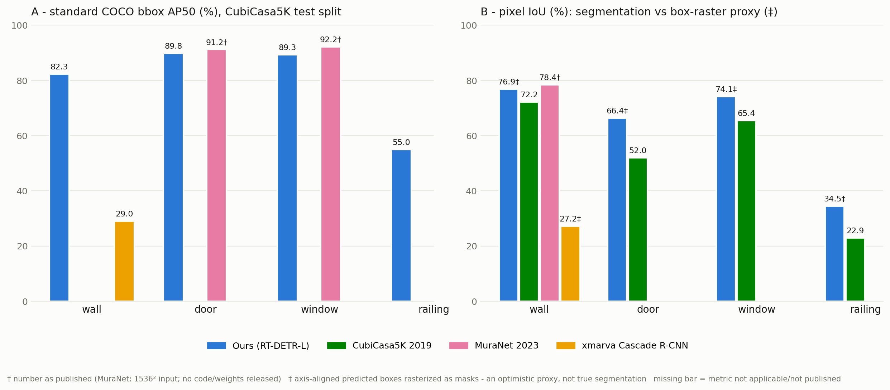

# RT-DETR-L Structural Floor-Plan Detector

Detects the load-bearing structure of a floor-plan image in one pass:
**walls, doors, windows, railings, linkage points** (5 classes).

This is a straightforward application of **RT-DETR**
([Zhao et al., arXiv:2304.08069](https://arxiv.org/abs/2304.08069), of the
DETR family — [Carion et al., arXiv:2005.12872](https://arxiv.org/abs/2005.12872))
to the floor-plan domain: the architecture is the unmodified RT-DETR-L as
implemented in the [Ultralytics](https://github.com/ultralytics/ultralytics)
library (also used here for training and inference; AGPL-3.0). What this
package contributes is the task adaptation (5 structural classes), the
training recipe, the trained weights, and an honest benchmark against prior
CubiCasa5K methods.

Part of the **Architect Ant** paper —
[arXiv:2606.10953](https://arxiv.org/abs/2606.10953)
([HTML](https://arxiv.org/html/2606.10953)).

## Model card

| | |
|---|---|
| architecture | RT-DETR-L ([Ultralytics](https://docs.ultralytics.com/models/rtdetr/) implementation), 32.8 M parameters |
| checkpoint | `weights/rtdetr_l_autoresearch_60ep.pt` — **66 MB** (FP16 weights only, no optimizer state; inference-ready single file) |
| input | 1024×1024 (trained & evaluated; other sizes degrade accuracy) |
| training | CubiCasa5K official split (4200 train), 60 epochs, 2×A100 (~2.3 h) |
| classes | wall · door · window · railing · linkage_point |

Test-split accuracy (official CubiCasa5K 400-image test set):

| class | COCO AP50 | COCO AP@[.5:.95] | polygon-GT AP@0.5 (strict) |
|---|---|---|---|
| wall | 82.3 | 52.8 | 73.3 |
| door | 89.8 | 57.5 | 84.8 |
| window | 89.3 | 62.2 | 85.5 |
| railing | 55.0 | 27.4 | 47.0 |
| linkage_point | 60.0 | 26.5 | 56.6 |

## How it compares (see [`Results/`](Results/comparison_all_methods.md))



- **vs CubiCasa5K (2019, segmentation):** better *in their own pixel-IoU
  metric* on all four shared classes (e.g. wall 76.9 vs 72.2, door 66.4 vs
  52.0 — their model re-measured with their own released code & weights).
- **vs MuraNet (2023):** we tie their YOLOv3 baseline at door/window AP50
  (89.6) and beat MuraNet itself on the strict AP@[.5:.95] by **+6 pts**
  (59.9 vs 53.8). MuraNet's headline AP50 (91.7) **is not measured on the
  official test split** — their paper uses a custom 4000/500/500 split
  (figures captioned "Validation"), a **1000-epoch** training budget (vs our
  60), and released no code or weights; measured split-noise alone is ±2 pts.
  Details: [`Results/vs_muranet.md`](Results/vs_muranet.md).
- **vs xmarva Cascade R-CNN:** wall AP50 **82.3 vs 29.0** under a fully
  identical protocol — with **2.7× fewer parameters** (32.8 M vs 88.3 M;
  our 66 MB FP16 inference checkpoint vs their 353 MB of FP32 weights).
- No other method detects railings or linkage points at all.

Per-method reports: [`vs_cubicasa5k.md`](Results/vs_cubicasa5k.md) ·
[`vs_muranet.md`](Results/vs_muranet.md) ·
[`vs_xmarva.md`](Results/vs_xmarva.md) ·
[`comparison_all_methods.md`](Results/comparison_all_methods.md) (unified
tables + caveats).

## Run it on your own images

### 1. Environment

```bash
python -m venv .venv && source .venv/bin/activate      # or conda create -n floorplan python=3.10
pip install -r requirements.txt
# GPU (optional, ~0.1 s/image vs ~2 s/image on CPU):
#   pip install torch torchvision --index-url https://download.pytorch.org/whl/cu121
```

### 2. Predict

```bash
python predict.py path/to/plan.png                     # one image
python predict.py path/to/folder --out-dir out/        # every image in a folder
python predict.py plan.jpg --save-json                 # also dump raw boxes as JSON
python predict.py plan.jpg --conf 0.15                 # lower threshold, more recall
```

Each input produces `<name>_pred.png` — bold hatched boxes (walls rendered
below, doors/windows on top), per-class counts in the legend, confidence on
every non-wall label. `--save-json` adds `<name>_pred.json` with
`{cls, conf, xyxy}` per detection for programmatic use.

Defaults: `--conf 0.25` (the threshold all reported numbers use),
`--imgsz 1024`, auto GPU/CPU. Run `python predict.py -h` for everything.

### 3. Examples

[`examples/`](examples/) contains three AntPlan test plans with their
predictions, produced by exactly this tool. Note the **domain gap**: the
model is trained on CubiCasa5K, whose plans contain relatively little
interior furnishing, while AntPlan-style plans are densely furnished (beds,
wardrobes, closets, appliances) — expect some furniture-induced false
positives and misses. Observed transfer behavior: walls and corner linkage
points transfer robustly; window confidence depends on the drawing
convention (0.9+ on line-art glyphs, ~0.3–0.5 on rendered styles); faint
dashed door arcs may need `--conf 0.15`.

## Retrain / evaluate yourself

Training and evaluation code is included; the **dataset is not**. Get
CubiCasa5K from [zenodo](https://zenodo.org/record/2613548) and prepare it in
this layout (paths below use `CubiCasaPath` as a placeholder — put it
wherever you like):

```
CubiCasaPath/
├── cubicasa5k_yolo/                 # detection dataset for train.py
│   ├── images/{train,val,test}/     #   plan images
│   └── labels/{train,val,test}/     #   YOLO txt: cls cx cy w h (normalized)
└── annotations/{val,test}.json      # COCO polygon annotations for eval.py
                                     #   (cats: 1=wall 2=door 3=window
                                     #          5=railing 6=linkage_point)
```

```bash
# 1. train — edit data.yaml (point `path:` at CubiCasaPath/cubicasa5k_yolo),
#    set DEVICE/BATCH in train.py for your hardware, then:
python train.py                          # 60 ep @ 1024², ~2.3 h on 2×A100

# 2. evaluate any checkpoint under all three protocols
#    (standard COCO AP · strict polygon-GT AP · box-raster pixel IoU):
python eval.py --model runs/train/weights/best.pt \
    --coco-json CubiCasaPath/annotations/test.json \
    --img-root  CubiCasaPath
```

`train.py` encodes the exact recipe of the released checkpoint (RT-DETR-L,
60 epochs, 1024², AdamW auto-LR, warmup 1, cosine schedule with lrf 0.1,
vertical+horizontal flips). `eval.py --model weights/rtdetr_l_autoresearch_60ep.pt`
reproduces the model-card table above.

## Citation

If you use this model or the comparison results, please cite the Architect
Ant paper ([arXiv:2606.10953](https://arxiv.org/abs/2606.10953)), the
CubiCasa5K dataset (Kalervo et al., 2019, arXiv:1904.01920), the
underlying detector: RT-DETR (Zhao et al., arXiv:2304.08069) / DETR
(Carion et al., arXiv:2005.12872), and the
[Ultralytics](https://github.com/ultralytics/ultralytics) library
(Jocher, Qiu & Chaurasia — training/inference implementation used here).
